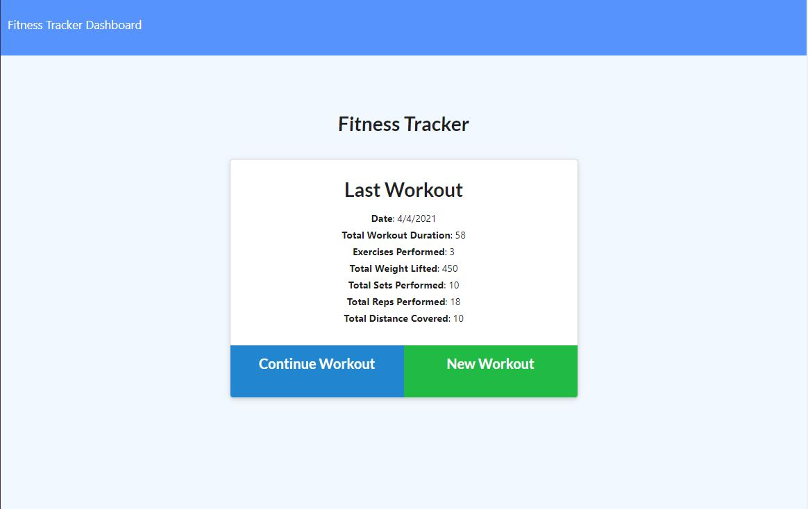
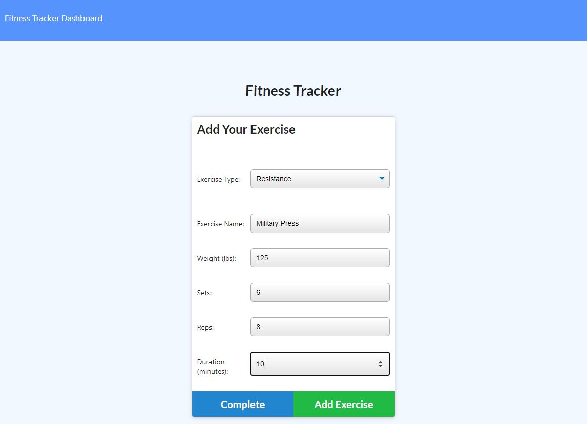
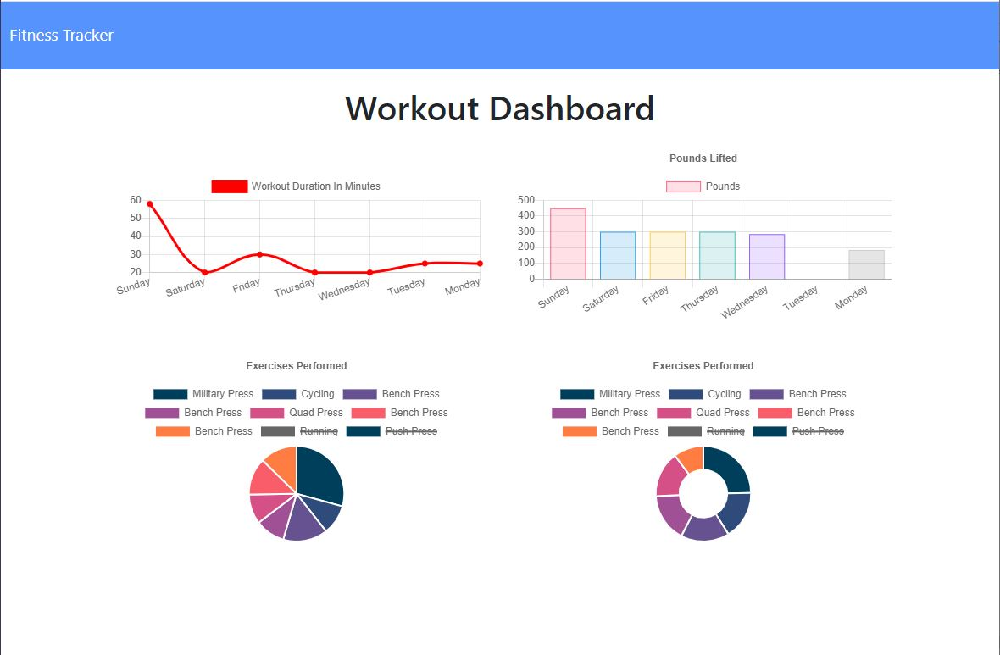

# The Llanes Workout Tracker

## Deployed site

https://obscure-retreat-71757.herokuapp.com/
https://github.com/mrllanes/Workout-Tracker-NoSQL-

## Table of Contents

-   [Description](#description)
-   [Installation](#installation)
-   [Usage](#usage)
-   [Technology](#technology)
-   [Contributions](#contributions)
-   [Questions](#questions)

## Description

Are you trying to get healthy and have started exercising more? You could use a Workout Tracker to keep track of your activities while on your way to a healthier lifestyle! The Llanes Workout Tracker is a simple exercise tracker that lets you input your exercises and graphically shows you how much time you are using for those activies.

## Installation Instructions

The Llanes Workout Tracker is live at the above mentioned heroku link. Go to the webpage and start using it. Alternatively, you can branch to this repo, download the files, do a node install (npm install), run the node server (node server), then use your browser to navigate to localhost:3000

## Usage

When landing at the website, click on "Continue Workout" or "Add Workout,"then select your exercise type, then fill in the information for the workout you just did or are about to do. That is it! When you are done you can go to the "Dashboard" and the app will show you a graphical chart with your accumulated information.

## Technology Stack

The following technologies were used to create this site/application/software/project:
Various Node modules including Mongoose and Express

## Contributions

The following individuals contributed to the creation of this site/application/software/project:
Super Awesome support team and Incredibly Awesome Instructor/Facilitator. Also very nice and enthusiastic Cohort members.

## Questions

If you have questions or comments about this project, please feel free to contact me via e-mail:
llanesm@gmail.com

You can also find more of my projects on my GitHub page:
https://github.com/mrllanes

## Screenshots

Please see the images below to see how the Llanes Workout Tracker App looks!

